# Beauty Diagram for Obsidian

> **Make your Mermaid and PlantUML diagrams look like deck slides — without leaving your vault.**

Beautify every ` ```mermaid ` and ` ```plantuml ` block in your Obsidian notes with 9 polished themes, in Reading View, with zero setup.

## See it in action

The same `flowchart LR` source, three different themes — rendered by [Beauty Diagram](https://www.beauty-diagram.com):

| Modern | Obsidian | Memphis (Premium) |
|---|---|---|
|  |  | 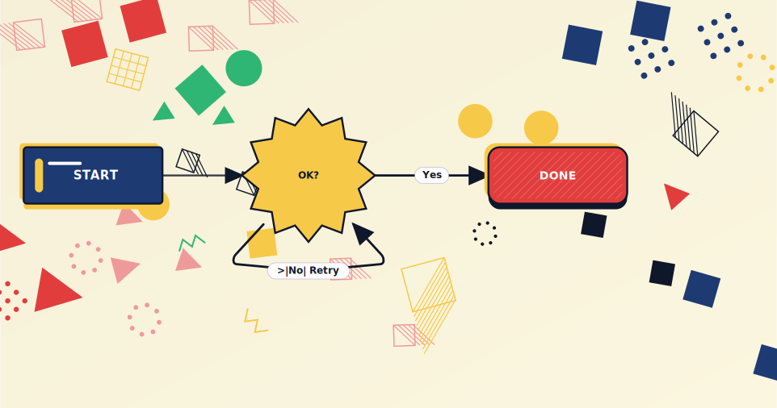 |

## Why

- **9 polished themes** out of the box: Classic, Modern, Slate, Atlas, Obsidian, Brutalist, Atelier, Blueprint, Memphis.
- **Dark-mode friendly** — diagrams keep contrast on dark vault backgrounds.
- **Zero setup** — install, enable, every mermaid block is rendered through Beauty Diagram. No API key needed for the free tier (anonymous renders are watermarked).
- **Per-block theme override** with a one-line directive. Mix themes in the same note.
- **Embed share URLs** — one command bakes `` references into the markdown so any reader (GitHub, Notion paste, blog static sites, plugin-less colleagues) sees the polished diagram.
- **PlantUML supported** too, with the same theming pipeline. No local Java required.
- **Honest error handling** — if the Beauty Diagram service is unreachable, the error UI lets you one-click disable the plugin for mermaid blocks and revert to Obsidian's built-in renderer.

## Theme gallery

| Classic | Modern | Slate |
|---|---|---|
|  |  |  |

| Atlas (Pro) | Obsidian (Pro) | Brutalist (Pro) |
|---|---|---|
|  |  | 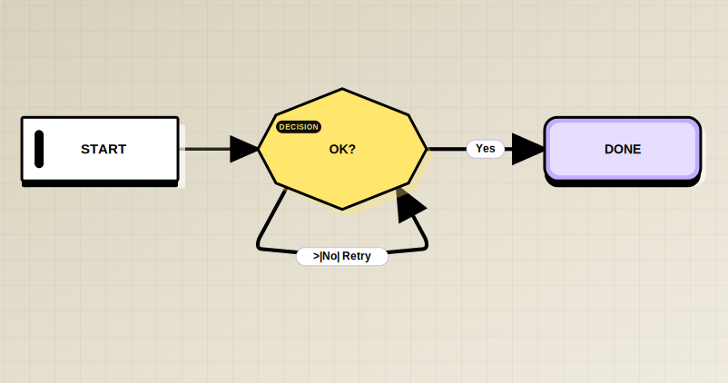 |

| Atelier (Pro) | Blueprint (Premium) | Memphis (Premium) |
|---|---|---|
| 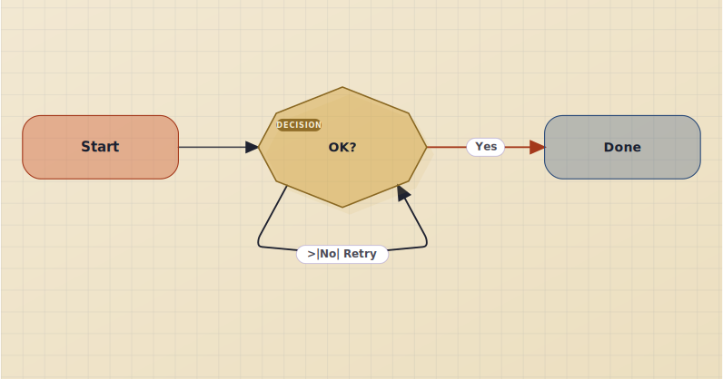 |  |  |

Sequence diagrams get the same treatment:


And PlantUML:


## Installation

1. Open Obsidian → **Settings → Community plugins**.
2. Click **Browse** and search for **Beauty Diagram**.
3. **Install**, then **Enable** the plugin.
4. Open any note with a ` ```mermaid ` or ` ```plantuml ` block in **Reading View**.

### Early access via BRAT (optional)

If you want to test pre-release builds ahead of the Community Plugins
listing, install [BRAT](https://github.com/TfTHacker/obsidian42-brat),
then **Add Beta plugin** → paste `beauty-diagram/obsidian-beauty-diagram`.

## Usage

### Default render

Every ` ```mermaid ` and ` ```plantuml ` block in **Reading View** is rendered through Beauty Diagram automatically. Live Preview shows Obsidian's built-in renderer; switch to Reading View to see the beautified version.

### Per-block theme override

Want Classic on one block and the default on the rest? Put a directive on the first line:

````md

````

For PlantUML use `' bd:theme=classic` instead.

You can stack directives — one per line. `bg=transparent` keeps the diagram's canvas transparent for overlay on colored backgrounds:

````md

````

Supported keys: `theme` (any of the 9 themes), `bg` (`transparent` only), `exclude`. Directive lines are consumed by the plugin and stripped before rendering.

### Opting a block out entirely

Prefer Obsidian's own rendering for a specific diagram? Add `%% bd:exclude` and the plugin leaves that block to the built-in renderer — no Beauty Diagram request, and the "Embed share URLs" commands skip it (removing any embed they previously added):

````md
```mermaid
%% bd:exclude
gantt
  title I like the native gantt
```
````

### Two ways to go watermark-free

Beauty Diagram offers two distinct features, depending on who you want to see the polished diagrams. Pick the one that matches your intent — they're independent and can be combined.

#### Option 1 — Watermark-free preview (for your own viewing in Obsidian)

By default every diagram renders via the anonymous endpoint `/v1/beautify.svg` — fast, no quota, **always watermarked**. This applies to everyone including Pro users.

If you have a Pro or Premium plan, you can opt in **per page** to render diagrams without watermark **in your own Obsidian**:

1. Open the page in any view.
2. Command Palette → **Beauty Diagram: Toggle watermark-free preview for this page**.
3. The plugin adds a marker to the page's YAML front-matter:

   ```yaml
   ---
   # Beauty Diagram: share-mode (watermark-free preview, consumes share quota per unique diagram).
   bd-share: true
   ---
   ```

4. Switch to Reading View — diagrams now render via `/v1/share/<id>.svg` and your Pro/Premium account drops the watermark.

> **Scope**: this only changes what _you_ see in your own Obsidian. The markdown source body is unchanged, so anyone reading the same `.md` file outside your plugin (GitHub, Notion paste, a colleague without the plugin) still sees the watermarked anonymous render. To share watermark-free, use Option 2.

**Quota model**: each unique diagram source consumes 1 share quota (Pro: 100/month) on its first preview. Subsequent previews of the same source hit the local cache for free. Editing a diagram counts as a new unique source.

Run the toggle command again to disable — the marker is removed and the page reverts to anonymous render.

**Free users** see an upgrade prompt and no marker is written, so no quota is consumed by mistake.

#### Option 2 — Embed share URLs (so anyone, anywhere, sees the diagram)

When you want to publish your vault (Obsidian Publish, paste to Notion, blog export, GitHub README, etc.) **and** have the polished diagrams render for readers who don't have the plugin, run from Command Palette (`Cmd+P`):

- **Beauty Diagram: Embed share URLs into this note** — walks every Mermaid / PlantUML fence in the active note and inserts an `` reference next to it that renders anywhere standard markdown is read.
- **Beauty Diagram: Embed share URLs into this vault** — same operation across every `.md` file in the vault. Idempotent — re-running leaves existing embeds untouched (unless the fence source changed).
- **Beauty Diagram: Clean orphan embeds in vault** — removes embed blocks whose source fence has been deleted.

The injected `` URLs are watermark-free when an API key is configured (Pro+ account); otherwise they fall back to the anonymous watermarked URL — so the embed command never breaks just because you don't have a paid plan.

> **Difference from Option 1**: this modifies your notes (writes `` HTML). The diagram-rendering URL is baked into the markdown itself, so anyone who reads the file — even outside Obsidian — gets the polished render directly from our server. Same marker format as the [`bd` CLI](https://www.npmjs.com/package/@beauty-diagram/cli) and VS Code extension, so all three tools interoperate.

## Configuration

| Setting | Default | Notes |
|---|---|---|
| API key | empty | Optional. Required for watermark-free preview and for watermark-free embed URLs. Without one, preview renders anonymously (watermark, 5 KB source cap) and the embed command falls back to anonymous URLs. Get one at [beauty-diagram.com/account/api-keys](https://www.beauty-diagram.com/account/api-keys). |
| Default theme | Classic | One of 9. Per-block directive overrides. |
| Replace built-in mermaid render | on | Off lets Obsidian render mermaid blocks itself. |
| Handle plantuml fences | on | Obsidian has no built-in plantuml renderer. |
| Auto-inject on save | off | When on, every Markdown save runs the embed-share-URLs command. |

The **Verify** button next to the API key field surfaces your current plan and this month's share quota usage — use it before / after enabling watermark-free preview to confirm the gating.

## How it compares

| | Beauty Diagram | Obsidian built-in mermaid | obsidian-plantuml |
|---|---|---|---|
| Mermaid support | ✓ | ✓ | — |
| PlantUML support | ✓ (no local setup) | — | ✓ (needs local Java or PUML server) |
| Themes | 9 | 1 | 1 |
| Dark-mode contrast | ✓ | depends on vault theme | depends |
| Source-injection (portable) | ✓ | — | — |
| Mobile-friendly | ✓ | ✓ | depends |

## FAQ

**Q: Does the plugin work in Live Preview?**
A: Not yet — render runs in Reading View only. Live Preview falls back to Obsidian's built-in. Roadmap.

**Q: Where do my diagrams go?**
A: Anonymous renders (default) are stateless — the source is encoded directly into the embed URL and rendered on demand. The server doesn't persist anything. Watermark-free preview (Pro+ opt-in) saves the source to your Beauty Diagram account so it can be served watermark-free and shared via public URL — that's why it consumes share quota.

**Q: My Pro key isn't removing the watermark.**
A: API key alone doesn't auto-enable watermark-free preview — that would silently consume your monthly share quota. Watermark-free is an explicit per-page opt-in: run **Beauty Diagram: Toggle watermark-free preview for this page** from the Command Palette. The plugin adds `bd-share: true` to the front-matter and renders that page via the share endpoint. See [Option 1 — Watermark-free preview](#option-1--watermark-free-preview-for-your-own-viewing-in-obsidian) above.

**Q: I shared a `.md` file with a colleague who doesn't have the plugin — they still see watermarks.**
A: The toggle command only affects what _you_ see in _your_ Obsidian; the markdown source body is unchanged. To share the polished render with someone who has no plugin, run **Beauty Diagram: Embed share URLs into this note** — that writes `` URLs directly into the file so any standard markdown renderer (GitHub, Notion, blog static sites) will display the same diagram. See [Option 2 — Embed share URLs](#option-2--embed-share-urls-so-anyone-anywhere-sees-the-diagram) above.

**Q: Mobile support?**
A: Yes. The plugin uses Obsidian's `requestUrl` API which works on iOS / Android. Image cache size is smaller on mobile (200 entries vs 1000 desktop).

**Q: I want to edit the diagram in a richer editor.**
A: Hover any rendered diagram — a small **↗ Open in editor** badge appears in the bottom-right corner. Click it to open the [Beauty Diagram editor](https://www.beauty-diagram.com/editor) with the source prefilled. Edits there don't sync back to your Obsidian note — use Obsidian's source mode for that.

**Q: I see "Couldn't render this diagram".**
A: Common causes: source > 5 KB without an API key, or your network is blocking `api.beauty-diagram.com`. For mermaid blocks, click "Use Obsidian's built-in renderer" in the error UI to disable Beauty Diagram for mermaid and let Obsidian render them itself. PlantUML has no built-in fallback — re-enable network access or restore connectivity.

## Privacy

**This plugin makes HTTP requests to `api.beauty-diagram.com` by default** to render diagrams. Disclosure:

- **Anonymous render**: every ` ```mermaid ` / ` ```plantuml ` block in Reading View triggers a GET to `/v1/beautify.svg` with the block's source base64url-encoded into the URL query string. The server uses the source to render the SVG and does **not** persist it.
- **Watermark-free preview (per-page opt-in)**: pages with `bd-share: true` in front-matter send their diagrams via POST to `/v1/share` using your API key. The server saves these to your Beauty Diagram account so they can be served watermark-free (see [privacy policy](https://www.beauty-diagram.com/privacy)). Without the front-matter marker the share endpoint is not called.
- **Embed share URLs command**: explicit user action via Command Palette. Same `/v1/share` path as the toggle but writes the resulting `` URLs into the markdown file so the diagrams render anywhere markdown is read.
- **Analytics**: the plugin sends an `X-Bd-Client: obsidian` request header so we can see in aggregate which clients are healthy. No personal data, no telemetry endpoints beyond standard request logs.

### Opt-out

Two levels of opt-out:

1. **Disable the plugin entirely** — Settings → Community plugins → toggle Beauty Diagram off. Obsidian's built-in mermaid renders blocks; plantuml fences stay as plain text. Zero network requests.
2. **Disable per source format** — Settings → Beauty Diagram → toggle "Replace built-in mermaid render" or "Handle plantuml fences" off. Affected blocks fall back to Obsidian default (mermaid) or plain text (plantuml). No network requests for the disabled format.

### Self-host

If you run your own Beauty Diagram server (the project is self-hostable), set Settings → Beauty Diagram → Advanced → API base URL to your instance. The plugin will hit only that origin, never the hosted SaaS.

## License

MIT. See [LICENSE](LICENSE).
